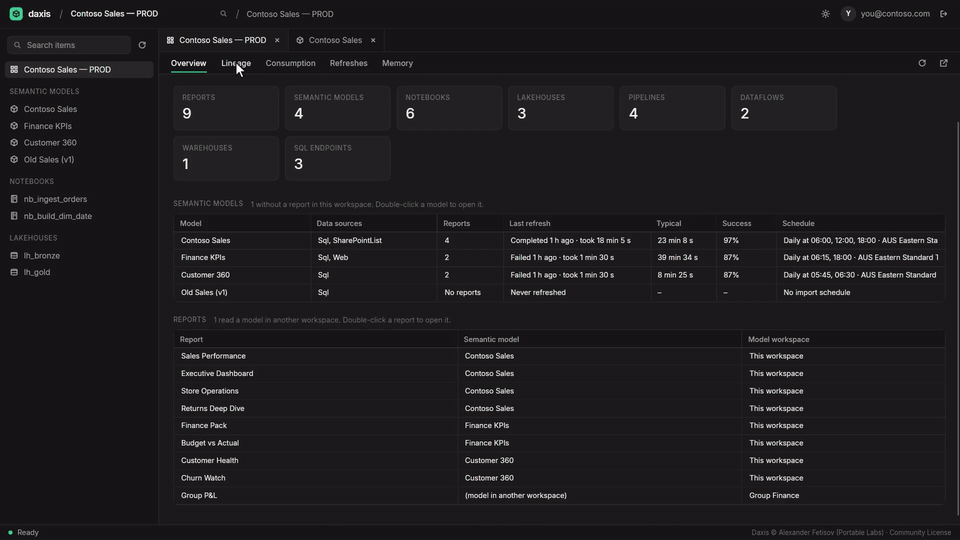
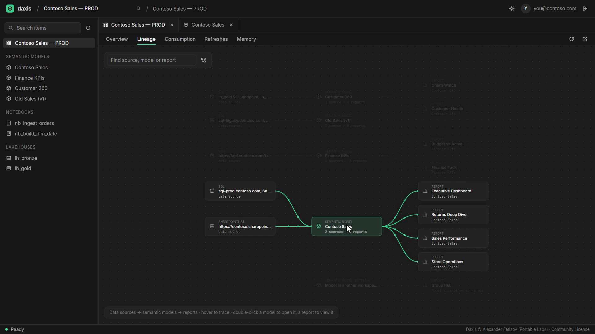
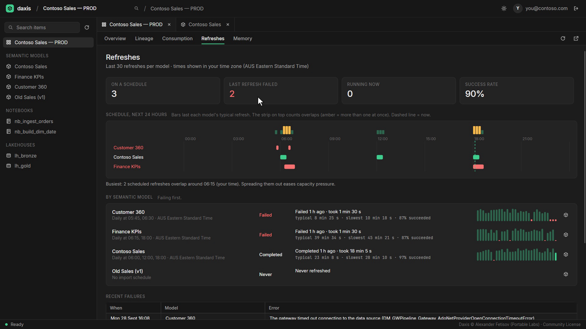
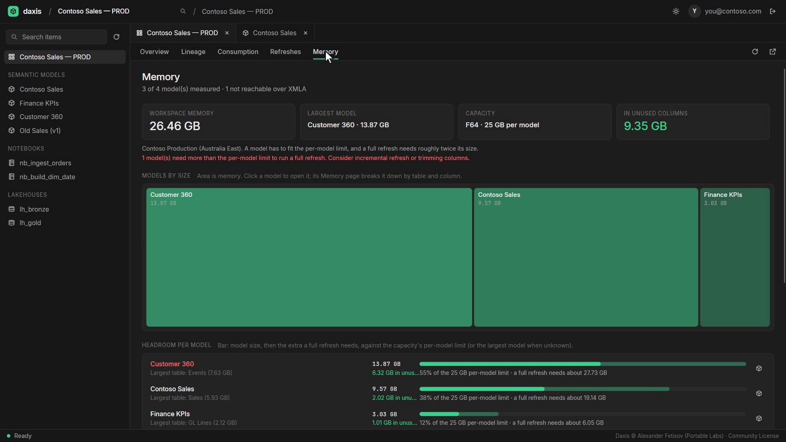
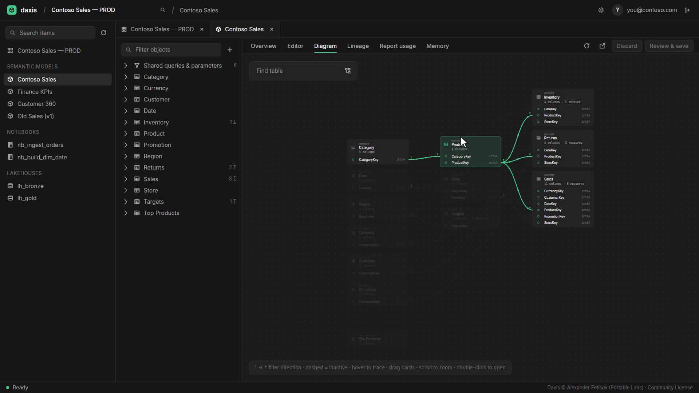
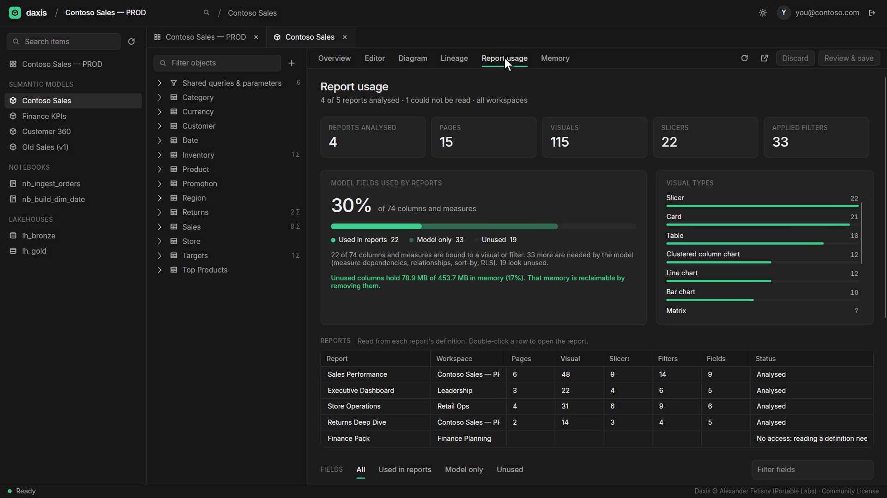
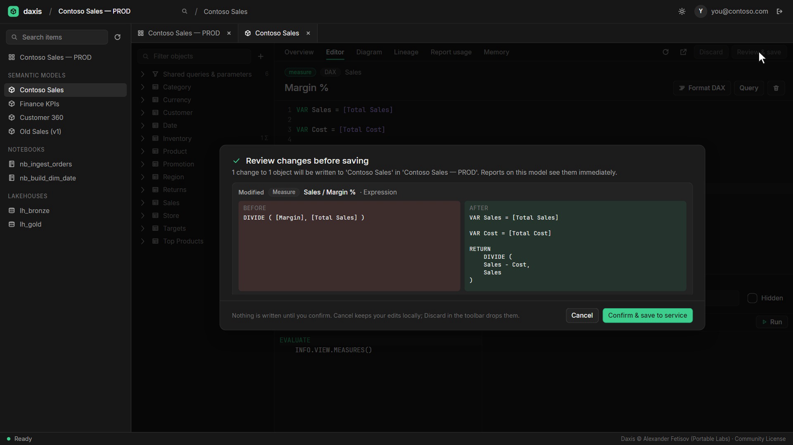

<div align="center">

# Daxis

**The desktop editor for Microsoft Fabric semantic models.**
See how your models, reports and refreshes fit together, where the memory goes and what nobody uses. Edit DAX and Power Query safely.
Windows and Linux. Free for individuals and small businesses.

[](https://github.com/AFetisa/daxis/actions/workflows/ci.yml)


[](LICENSE)



<sub>[Watch the 80-second video](docs/media/demo.mp4) · [portable-labs.com](https://www.portable-labs.com) · All screenshots use fictional sample data.</sub>

</div>

## What it does

**Workspace**
- **Overview:** every item, model and report, with who reads what, including models in other workspaces.
- **Lineage:** data sources → semantic models → reports. Hover any card to trace its path.
- **Consumption:** how much of each model your reports actually use.
- **Refreshes:** a 24-hour schedule timeline that shows overlaps, success rates, and failures explained in plain English.
- **Memory:** each model against your capacity's per-model limit (and the ~2× a full refresh needs).

**Semantic model** (live over XMLA)
- **Diagram** of tables and relationships, and **pipeline lineage** from source query to report.
- **Report usage:** pages, visuals, slicers and filters per report, and every column and measure marked *used in reports*, *model only* or *unused*.
- **Memory:** size per table and column, what it's made of, and how much sits in unused columns.
- **Refresh health** and per-table freshness.
- **Edit** DAX and Power Query with IntelliSense and formatters. **Every change is reviewed** before/after, and nothing is written until you confirm.

**Also:** notebooks (edit, save, run), lakehouses (tables and files), Ctrl+K workspace search, light and dark themes.

<table>
  <tr>
    <td></td>
    <td></td>
  </tr>
  <tr>
    <td align="center"><sub>Workspace lineage</sub></td>
    <td align="center"><sub>Refreshes: schedule overlaps and failures</sub></td>
  </tr>
  <tr>
    <td></td>
    <td></td>
  </tr>
  <tr>
    <td align="center"><sub>Memory per model</sub></td>
    <td align="center"><sub>Model diagram</sub></td>
  </tr>
  <tr>
    <td></td>
    <td></td>
  </tr>
  <tr>
    <td align="center"><sub>Report usage</sub></td>
    <td align="center"><sub>Review every change before it's saved</sub></td>
  </tr>
</table>

## Get it

**Download** (no install): grab `Daxis-<version>-win-x64.exe` or `Daxis-<version>-linux-x64` from [Releases](https://github.com/AFetisa/daxis/releases) and run it. Each release has SHA-256 checksums and build-provenance attestations (`gh attestation verify <file> --repo AFetisa/daxis`).

**From source** (needs the [.NET 8 SDK](https://dotnet.microsoft.com/download/dotnet/8.0)):
```bash
git clone https://github.com/AFetisa/daxis.git
cd daxis
./run.sh          # Linux, Git Bash
.\run.ps1         # Windows PowerShell
```
`git pull`, then run again to update. To build your own single-file executable: `./run.sh --publish` (or `.\run.ps1 -Publish`), output in `dist/`.

Linux needs a desktop session. Minimal images and WSL may also need `sudo apt install libice6 libsm6 libfontconfig1`.

## What you need in Fabric

- A work or school account with access to the workspace.
- For semantic models: a workspace on **Fabric, Premium or PPU** capacity with the **XMLA endpoint** enabled (read-write to edit), and Contributor or higher.
- Report usage reads report definitions, which Fabric only allows with **edit rights on the report**.

## Security

- **No Daxis server, no telemetry.** Daxis only talks to Microsoft sign-in, Fabric, Power BI and OneLake.
- **Tokens stay on your machine** (DPAPI-encrypted on Windows, owner-only on Linux) and are never sent to any other host.
- **Nothing changes in Fabric without your confirmation.**
- Sign-in uses the Power BI Desktop public client. To use your own Entra app, set `DAXIS_CLIENT_ID`. `DAXIS_HOME` moves the data folder.

Details and vulnerability reporting: [SECURITY.md](SECURITY.md).

## License

**Source-available** under the [Daxis Community License 1.0](LICENSE), not open source.

| Who | Terms |
|---|---|
| Individuals, non-profits, education, small businesses (< 50 people **and** < AUD 10M) | Free |
| Other for-profit organisations | Free, with acknowledgement of ownership |
| Major consultancies (1,000+ people or AUD 100M+) | Written consent required |

Modifying or building on the code needs written consent (pull requests to this repo are welcome). The [LICENSE](LICENSE) text governs. Third-party components: [THIRD-PARTY-NOTICES.md](THIRD-PARTY-NOTICES.md).

---

Built by [Alexander Fetisov](https://github.com/AFetisa) at [Portable Labs](https://www.portable-labs.com). C# / .NET 8, Avalonia, AvaloniaEdit, the Tabular Object Model and MSAL. [Contributing](CONTRIBUTING.md) · [Changelog](CHANGELOG.md)

Daxis is not affiliated with or endorsed by Microsoft. Microsoft Fabric and Power BI are trademarks of Microsoft.
